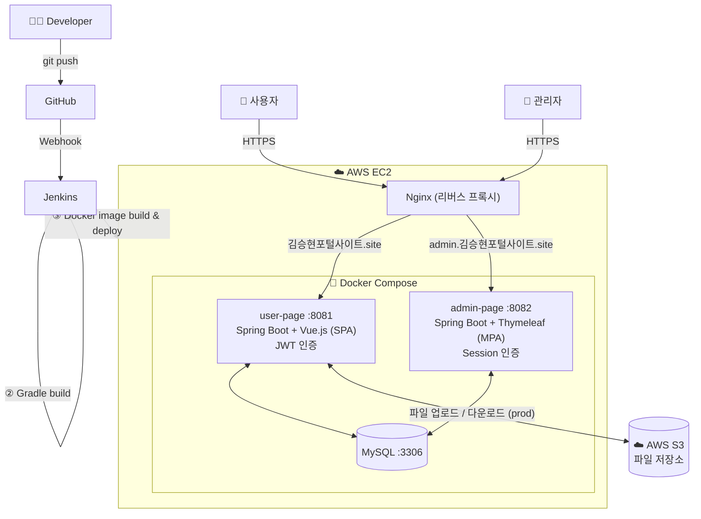

# 📋 게시판 포탈 사이트

## 📝 프로젝트 개요
이 프로젝트는 **다양한 게시판을 통합적으로 관리할 수 있는 포털 사이트**를 구축하는 것을 목표로 합니다.  
단순 기능 구현에 그치지 않고, **AWS EC2 환경에 Docker + Nginx로 직접 배포하고 Jenkins CI/CD 파이프라인을 구축**하여 실제 운영 환경까지 경험하는 것을 목표로 했습니다.

- **게시판 종류**: 자유 게시판, 문의 게시판, 갤러리 게시판, 공지사항
- **아키텍처 구성**:
  - **사용자 페이지**: SPA(Single Page Application) 구조, **Spring Boot + Vue.js** 기반
  - **관리자 페이지**: MPA(Multi Page Application) 구조, **Spring Boot + Thymeleaf** 기반
- **서버 분리**: 사용자 페이지와 관리자 페이지를 각각 독립된 Docker 컨테이너로 분리하여 운영하며, 인증 방식도 JWT와 Session으로 역할에 맞게 구분했습니다.
- **ORM 비교**: 동일한 서비스 인터페이스에 JPA와 MyBatis 구현체를 각각 작성하여 두 ORM의 동작 방식과 쿼리 성능을 직접 비교할 수 있도록 설계했습니다.

## 💻 프로젝트 아키텍처



## 💻 게시판 구조
+ **관리자 페이지**

  

+ **사용자 페이지**

  


## 🔗 게시판 페이지 링크
+ **[관리자 페이지](https://admin.김승현포털사이트.site/login) (MPA 버전)**
 
> **관리자 아이디:** admin  
> **관리자 비밀번호:** admin
 
+ **[사용자 페이지](https://김승현포털사이트.site) (SPA 버전)**

> **사용자 아이디:** user  
> **사용자 비밀번호:** 1234


## 📺 화면
  + **메인 페이지 및 로그인**
  

https://github.com/rooluDev/board-portal-project/assets/152958052/a7594704-185f-46af-a8ab-c3975048afe6

  + **게시물 검색**


https://github.com/rooluDev/board-portal-project/assets/152958052/d1e4bd23-f7bd-4f99-948e-d6230cfc6082


  + **게시판 작성**
  

https://github.com/rooluDev/board-portal-project/assets/152958052/d6bdab38-46f8-4d8b-aa4b-09945b361388


  + **게시판 수정**

https://github.com/rooluDev/board-portal-project/assets/152958052/a27fb564-752d-4474-ae85-1f373fdb7843


  
  + **댓글 등록**


https://github.com/rooluDev/board-portal-project/assets/152958052/8b9cae92-1f60-4d93-84f9-7eb3df5dc3bf


  + **파일 다운로드**
  

https://github.com/rooluDev/board-portal-project/assets/152958052/513d4a70-ab98-4436-8060-178c9e7edbed


## 💡 주요 기능

### 1️⃣ 파일 저장소 유연성 확보

이 기능은 **파일의 물리적 저장 위치(local storage, NAS, cloud storage 등)**가 변경되더라도  
애플리케이션 로직을 수정하지 않고 쉽게 대응할 수 있도록 설계되었습니다.  
이를 위해 **파일의 메타데이터(DB 저장)와 실제 물리적 파일 저장 로직을 분리**하였으며,  
`FileStorageService`가 이 두 서비스를 주입받아 통합적으로 처리하도록 구성했습니다.  
이 구조를 통해 파일 저장소의 변경이 필요한 경우에도 StorageService 구현체만 교체하면 되어,  
유지보수성과 확장성이 크게 향상되었습니다.

  <details>
    <summary>코드 보기(펼치기/접기)</summary>

     물리적 파일의 저장 위치 변경에 대응하기 위하여 (local storage, cloud storage, NAS 등...) 물리적 파일을 저장하는 StorageService Interface와 metadata를 저장하는 FileService Interface를 분리하고 
     위 두 인터페이스를 의존성을 주입하여 작동하는 FileStorageService를 작성해 유연성을 확보하였다.
   
          Metadata 저장소
          ```
         /**
         * File Service Interface
         */
         public interface FileService {
         
             /**
              * File 등록
              *
              * @param fileList DB에 저장할 File List
              * @param boardId  boardId ( pk )
              * @return 저장된 FileList
              */
             List<FileDto> addFileList(List<FileDto> fileList, Long boardId);
      
             ...
          ```
      
          물리적 파일 저장소
          ```
         /**
          * Storage Service
          */
         public interface StorageService {
         
             /**
              * Multipart File 리스트 물리적 파일 생성
              *
              * @param multipartFiles 저장할 파일
              * @param boardType 보드 타입
              * @return 저장된 파일들 FileDto 리스트
              */
             List<FileDto> storageFileList(MultipartFile[] multipartFiles, String boardType);
         
             /**
              * FileDto로 썸네일 물리적 생성
              *
              * @param fileDto 생성할 원본 파일
              * @return 생성된 Thumbnail의 객체
              */
             ThumbnailDto storageThumbnailFromFile(FileDto fileDto);
         }
         ```
      
         FileStorageService impl
         ```
         /**
          * FileStorageService Impl
          */
         @Service
         @RequiredArgsConstructor
         @Primary
         public class FileStorageServiceImpl implements FileStorageService {
         
             private final StorageService storageService;
             private final FileService fileService;
             private final ThumbnailService thumbnailService;
      
         ...
         ```
  
      [FileStorage Service 전체 코드](https://github.com/rooluDev/board-portal-project/blob/main/user-page/backend/src/main/java/com/user/backend/service/FileStorageServiceImpl.java)
  
   </details>

### 2️⃣ JPA 동적쿼리 작성

이 기능은 **검색 조건이 다양하게 조합될 수 있는 게시판 검색 기능**을 효율적으로 처리하기 위해 구현되었습니다.  
JPA의 **Specification**과 **CriteriaBuilder**를 활용하여 조건별로 `Predicate`를 동적으로 생성하고,  
검색 조건이 없을 경우 해당 조건을 무시하도록 하여 **불필요한 where 절 생성을 방지**했습니다.

  <details>
   <summary>코드 보기(펼치기/접기)</summary>
     JPA의 Specification과 CriteriaBuilder를 활용하여 조건별 Predicate를 동적으로 생성하고, 검색 조건이 없는 경우에는 해당 조건을 무시하도록 구현.
  
     자유 게시판 Specification Class
     ```
     /**
       * 검색조건을 통한 쿼리 생성
       *
       * @param searchConditionDto 검색 조건
       * @return 쿼리
       */
      public static Specification<FreeBoard> findBySearchCondition(SearchConditionDto searchConditionDto) {
       ...
     ```
     
     FreeBoardRepository
     ```
     default Page<FreeBoard> findBySearchCondition(SearchConditionDto searchConditionDto) {
          Specification<FreeBoard> specification = FreeBoardSpecification.findBySearchCondition(searchConditionDto);
          Sort.Direction direction = Sort.Direction.fromString(searchConditionDto.getOrderDirection());
          String orderValue = searchConditionDto.getOrderValue() != null ? searchConditionDto.getOrderValue() : "createdAt";
          Pageable pageable = PageRequest.of(searchConditionDto.getPageNum() - 1, searchConditionDto.getPageSize(), direction, orderValue);
          return findAll(specification, pageable);
      }
     ```
  
     [FreeBoardSpecification 전체 코드](https://github.com/rooluDev/board-portal-project/blob/main/user-page/backend/src/main/java/com/user/backend/specification/FreeBoardSpecification.java)
  </details>

### 3️⃣ CI/CD 파이프라인 자동화

코드를 `git push`하면 Jenkins가 이를 감지하여 **빌드부터 배포까지 전 과정을 자동으로 처리**하도록 구성했습니다.  
Vue.js 프론트엔드 빌드, Spring Boot JAR 빌드, Docker 이미지 생성, 컨테이너 재기동이 하나의 파이프라인으로 연결되며,  
**MySQL 컨테이너는 재시작하지 않고 앱 컨테이너만 교체**하도록 `--no-deps` 옵션을 적용해 서비스 중단 시간을 최소화했습니다.  
또한 Jenkins 컨테이너가 호스트 파일 시스템에 직접 접근할 수 없는 환경 제약을 해결하기 위해,  
**Alpine 컨테이너를 일회성으로 실행해 빌드 결과물을 Nginx 서빙 경로로 복사**하는 방식을 사용했습니다.

  <details>
   <summary>코드 보기(펼치기/접기)</summary>

   Jenkinsfile
   ```
   pipeline {
       agent any
   
       stages {
   
           stage('Checkout') {
               steps {
                   checkout scm
               }
           }
   
           stage('Build Frontend - user-page') {
               steps {
                   // node:18-alpine 컨테이너에서 Vue 앱 빌드
                   // $WORKSPACE는 Jenkins 환경변수 — 호스트 경로와 1:1 매핑됨
                   sh '''
                       docker run --rm \
                         -v "$WORKSPACE/user-page/frontend:/app" \
                         -w /app \
                         node:18-alpine \
                         sh -c "npm ci && npm run build"
                   '''
               }
           }
   
           stage('Build JAR - user-page') {
               steps {
                   dir('user-page/backend') {
                       sh 'chmod +x gradlew'
                       sh './gradlew clean build -x test'
                   }
               }
           }
   
           stage('Build JAR - admin-page') {
               steps {
                   dir('admin-page/backend') {
                       sh 'chmod +x gradlew'
                       sh './gradlew clean build -x test'
                   }
               }
           }
   
           stage('Docker Build') {
               steps {
                   dir('user-page/backend') {
                       sh 'docker build -t user-page:latest .'
                   }
                   dir('admin-page/backend') {
                       sh 'docker build -t admin-page:latest .'
                   }
               }
           }
   
           stage('Deploy') {
               steps {
                   // ① 프론트엔드 빌드 결과물을 Nginx 서빙 경로로 복사
                   // Jenkins 컨테이너는 /home/ubuntu에 접근 불가 → Alpine 컨테이너로 호스트 경로 마운트해 복사
                   sh '''
                       docker run --rm \
                         -v "$WORKSPACE/user-page/frontend/build:/src" \
                         -v /home/ubuntu/user/frontend:/dst \
                         alpine sh -c "cp -r /src/. /dst/"
                   '''
   
                   // ② 프로젝트명 'potal' 고정, 앱 컨테이너만 재시작 (MySQL 제외)
                   sh '''
                       docker-compose -p potal \
                           --env-file /var/jenkins_home/.env.potal \
                           up -d --no-deps --force-recreate user-page admin-page
                   '''
               }
           }
       }
   }
   ```

   Dockerfile
   ```
   FROM eclipse-temurin:17-jre-alpine
   WORKDIR /app
   
   ARG JAR_FILE=build/libs/*.jar
   COPY ${JAR_FILE} app.jar
   
   ENTRYPOINT ["java", "-jar", "app.jar"]
   ```

   [Jenkinsfile 전체 코드](https://github.com/rooluDev/board-portal-project/blob/main/Jenkinsfile)
  </details>

### 4️⃣ JPA/MyBatis 이중 구현체 전환 구조

동일한 서비스 인터페이스에 대해 **JPA 구현체와 MyBatis 구현체를 각각 작성**하여,  
`@Qualifier`로 어느 쪽을 사용할지 선택할 수 있도록 설계했습니다.  
이 구조를 통해 두 ORM의 동작 방식과 성능을 같은 비즈니스 로직 위에서 비교할 수 있으며,  
특정 기능에서 더 적합한 방식으로 쉽게 전환이 가능합니다.  
현재 Controller는 JPA 구현체를 사용하고 있으며, MyBatis 구현체로 교체 시 Controller 생성자의 `@Qualifier` 값만 변경하면 됩니다.

  <details>
   <summary>코드 보기(펼치기/접기)</summary>

   Service Interface
   ```
   /**
    * Free Board Service Interface
    */
   public interface FreeBoardService {
   
       List<FreeBoardDto> getBoardListByCondition(SearchConditionDto searchConditionDto);
   
       Long addBoard(FreeBoardDto freeBoardDto);
   
       Optional<FreeBoardDto> getBoardById(Long boardId);
   
       void deleteBoard(Long boardId);
       ...
   }
   ```

   JPA 구현체
   ```
   @Service("freeBoardJpa")
   @RequiredArgsConstructor
   @Transactional
   public class FreeBoardServiceJpaImpl implements FreeBoardService {

       private final FreeBoardRepository freeBoardRepository;
       ...
   }
   ```

   MyBatis 구현체
   ```
   @Service("freeBoardMybatis")
   @RequiredArgsConstructor
   public class FreeBoardServiceImpl implements FreeBoardService {

       private final FreeBoardMapper freeBoardMapper;
       ...
   }
   ```

   Controller — @Qualifier로 구현체 선택
   ```
   public FreeBoardController(@Qualifier("freeBoardJpa") FreeBoardService freeBoardService,
                              @Qualifier("categoryJpa") CategoryService categoryService,
                              @Qualifier("fileJpa") FileService fileService,
                              @Qualifier("commentJpa") CommentService commentService,
                              ...) {
       this.freeBoardService = freeBoardService;
       ...
   }
   ```

   [FreeBoardServiceJpaImpl 전체 코드](https://github.com/rooluDev/board-portal-project/blob/main/user-page/backend/src/main/java/com/user/backend/service/jpa/FreeBoardServiceJpaImpl.java)

   [FreeBoardServiceImpl (MyBatis) 전체 코드](https://github.com/rooluDev/board-portal-project/blob/main/user-page/backend/src/main/java/com/user/backend/service/mybatis/FreeBoardServiceImpl.java)
  </details>

### 5️⃣ Spring Security 없이 JWT 인증 직접 구현

Spring Security를 사용하지 않고 **JWT 발급·파싱·검증 흐름을 직접 구현**했습니다.  
`JwtProvider`가 토큰 생성(HS256 서명, 만료 시간 설정)과 파싱(memberId 추출)을 담당하고,  
`JwtService`가 Controller 계층에서 사용할 수 있도록 요청 헤더 추출부터 예외 처리까지 래핑합니다.  
시크릿 키는 Base64 인코딩된 환경 변수로 주입받아 `InitializingBean`의 `afterPropertiesSet()`에서  
디코딩 후 HMAC 서명 키로 초기화합니다.

  <details>
   <summary>코드 보기(펼치기/접기)</summary>

   JwtProvider — 토큰 생성 및 파싱
   ```
   @Component
   public class JwtProvider implements InitializingBean {
   
       @Value("#{jwt['secret']}")
       private String secretKey;
   
       @Value("#{jwt['headerKey']}")
       private String headerKey;
   
       private Key key;
   
       @Override
       public void afterPropertiesSet() {
           byte[] keyBytes = Decoders.BASE64.decode(secretKey);
           this.key = Keys.hmacShaKeyFor(keyBytes);
       }
   
       public String createAccessToken(String memberId, String memberName) {
           Claims claims = Jwts.claims().setSubject(memberId);
           claims.put("memberName", memberName);
           Date now = new Date();
           return Jwts.builder()
                   .setClaims(claims)
                   .setIssuedAt(now)
                   .signWith(key, SignatureAlgorithm.HS256)
                   .setExpiration(new Date(now.getTime() + 999999999))
                   .compact();
       }
   
       public String getMemberIdFromJwt(String accessToken) {
           return Jwts.parserBuilder()
                   .setSigningKey(key)
                   .build()
                   .parseClaimsJws(accessToken)
                   .getBody()
                   .getSubject();
       }
   }
   ```

   JwtServiceImpl — 헤더 추출 및 예외 처리
   ```
   @Service
   @Primary
   public class JwtServiceImpl implements JwtService {
   
       private final JwtProvider jwtProvider;
   
       @Override
       public String getMemberIdFromToken(HttpServletRequest request) {
           try {
               String accessToken = jwtProvider.getHeaderFromToken(request);
               return jwtProvider.getMemberIdFromJwt(accessToken);
           } catch (MalformedJwtException | IllegalArgumentException e) {
               throw new NotLoggedInException(ErrorCode.NOT_LOGGED_IN);
           } catch (ExpiredJwtException e) {
               return null;
           }
       }
   
       @Override
       public String createToken(MemberDto memberDto) {
           return jwtProvider.createAccessToken(memberDto.getMemberId(), memberDto.getMemberName());
       }
   }
   ```

   [JwtProvider 전체 코드](https://github.com/rooluDev/board-portal-project/blob/main/user-page/backend/src/main/java/com/user/backend/jwt/JwtProvider.java)

   [JwtServiceImpl 전체 코드](https://github.com/rooluDev/board-portal-project/blob/main/user-page/backend/src/main/java/com/user/backend/service/JwtServiceImpl.java)
  </details>

### 6️⃣ @Profile 기반 AWS S3 스토리지 자동 전환

운영 환경에서는 파일을 **AWS S3에 저장**하고, 개발 환경에서는 **로컬 파일 시스템에 저장**하도록  
`@Profile` 어노테이션을 활용해 자동으로 구현체가 전환되도록 구성했습니다.  
S3 업로드 시 파일명은 UUID로 생성하고 `{boardType}/{uuid}.{ext}` 구조로 키를 구성하여 게시판 타입별로 파일을 분리합니다.  
썸네일은 S3에서 원본 파일을 읽어 메모리에서 Thumbnailator로 리사이즈한 뒤 `thumbnail/{uuid}.{ext}` 키로 다시 업로드합니다.  
`S3Client`는 `@PostConstruct`에서 환경 변수로 주입된 region 값을 기반으로 초기화됩니다.

  <details>
   <summary>코드 보기(펼치기/접기)</summary>

   S3StorageService — prod 프로파일 전용
   ```
   @Service
   @Profile("prod")
   public class S3StorageService implements StorageService {
   
       @Value("#{storage['bucket']}")
       private String bucket;
   
       @Value("#{storage['region']}")
       private String region;
   
       private S3Client s3Client;
   
       @PostConstruct
       public void init() {
           s3Client = S3Client.builder()
                   .region(Region.of(region))
                   .build();
       }
   
       @Override
       public List<FileDto> storageFileList(MultipartFile[] multipartFiles, String boardType) {
           for (MultipartFile multipartFile : multipartFiles) {
               String physicalName = UUID.randomUUID().toString();
               String extension = MultipartFileUtils.extractExtension(multipartFile);
               String s3Key = boardType + "/" + physicalName + "." + extension;
   
               s3Client.putObject(
                       PutObjectRequest.builder()
                               .bucket(bucket)
                               .key(s3Key)
                               .contentType(multipartFile.getContentType())
                               .contentLength(multipartFile.getSize())
                               .build(),
                       RequestBody.fromInputStream(multipartFile.getInputStream(), multipartFile.getSize())
               );
               ...
           }
       }
   
       @Override
       public ThumbnailDto storageThumbnailFromFile(FileDto fileDto) {
           // S3에서 원본 다운로드 → 메모리에서 300x300 리사이즈 → S3에 썸네일 업로드
           String sourceKey = fileDto.getBoardType() + "/" + fileDto.getPhysicalName() + "." + fileDto.getExtension();
           byte[] originalBytes = s3Client.getObjectAsBytes(...).asByteArray();
   
           ByteArrayOutputStream thumbnailOutput = new ByteArrayOutputStream();
           Thumbnails.of(new ByteArrayInputStream(originalBytes))
                   .size(300, 300)
                   .outputFormat(fileDto.getExtension())
                   .toOutputStream(thumbnailOutput);
   
           String thumbnailKey = "thumbnail/" + physicalName + "." + fileDto.getExtension();
           s3Client.putObject(..., RequestBody.fromBytes(thumbnailBytes));
           ...
       }
   }
   ```

   [S3StorageService 전체 코드](https://github.com/rooluDev/board-portal-project/blob/main/user-page/backend/src/main/java/com/user/backend/service/S3StorageService.java)
  </details>

### 7️⃣ SPA/MPA 서버 분리 설계

사용자 페이지와 관리자 페이지를 **별도 서버로 분리**하여 운영합니다.  
두 서버는 각각 독립된 Docker 컨테이너로 실행되며, Nginx가 도메인에 따라 요청을 각 서버로 라우팅합니다.  
인증 방식도 역할에 맞게 분리했습니다. **사용자 페이지는 JWT 기반 Stateless 인증**을 사용하고,  
**관리자 페이지는 HttpSession 기반 인증**을 사용합니다.  
또한 운영 환경에서 사용자 페이지 API는 CORS를 허용된 도메인으로만 제한하여,  
관리자 서버 URL로의 직접 API 접근을 원천 차단합니다.

  <details>
   <summary>코드 보기(펼치기/접기)</summary>

   docker-compose.yml — 서버 분리
   ```
   services:
     user-page:
       image: user-page:latest
       container_name: potal-user-page
       ports:
         - "8081:8081"
       environment:
         SPRING_PROFILES_ACTIVE: prod
         JWT_SECRET: ${JWT_SECRET}   # 사용자 페이지만 JWT 사용
       depends_on:
         mysql:
           condition: service_healthy
   
     admin-page:
       image: admin-page:latest
       container_name: potal-admin-page
       ports:
         - "8082:8082"
       environment:
         SPRING_PROFILES_ACTIVE: prod
                                       # 관리자 페이지는 JWT_SECRET 없음 — Session 기반
       depends_on:
         mysql:
           condition: service_healthy
   ```

   사용자 페이지 — CORS 도메인 제한 (prod)
   ```
   @Configuration
   @Profile("prod")
   public class WebMvcProdConfig implements WebMvcConfigurer {
   
       @Override
       public void addCorsMappings(CorsRegistry registry) {
           registry.addMapping("/**")
                   .allowedOrigins(
                           "https://xn--4k0bj36a8obp7hdvo59brzcrug.site",
                           "https://www.xn--4k0bj36a8obp7hdvo59brzcrug.site"
                   )
                   .allowedMethods("GET", "POST", "PUT", "DELETE", "PATCH")
                   .allowCredentials(true)
                   .maxAge(3600);
       }
   }
   ```

   관리자 페이지 — 세션 인터셉터
   ```
   // InterceptorHandler.java
   // 보호된 페이지 접근 시 세션 유무 확인, 없으면 /login 으로 리다이렉트
   public class InterceptorHandler implements HandlerInterceptor {
       @Override
       public boolean preHandle(HttpServletRequest request, ...) {
           Object session = request.getSession().getAttribute("ADMIN_SESSION_ID");
           if (session == null) {
               response.sendRedirect("/login");
               return false;
           }
           return true;
       }
   }
   ```

   [WebMvcProdConfig 전체 코드](https://github.com/rooluDev/board-portal-project/blob/main/user-page/backend/src/main/java/com/user/backend/config/WebMvcProdConfig.java)

   [InterceptorHandler 전체 코드](https://github.com/rooluDev/board-portal-project/blob/main/admin-page/backend/src/main/java/com/admin/backend/common/interceptor/InterceptorHandler.java)
  </details>


## 🗂 ERD


+ 댓글과 파일 테이블은 자유 게시판, 갤러리 게시판에 종속적이지만 외래키를 통해 접근을 하게 된다면 댓글과 첨부파일이 있는 게시판이 증설될 경우에 확장성이 높지 않다고 판단하여 boardType(게시판 종류), boardId(게시판 PK)를 구분자로 두어 진행했습니다.

+ 자유 게시판, 갤러리 게시판은 관리자와 사용자가 모두 작성이 가능해 이번 프로젝트의 ERD는 멤버, 관리자 테이블을 따로 두어 위와 같이 authorType(글쓴이 유형), authorId(글쓴이 PK)를 구분자로 두어 진행했습니다.

  
## 🛠 기술 스택
### 🔧 관리자 페이지(MPA)


### 🌐 사용자 페이지(SPA)


### 🗄 DB


### ☁ 인프라


